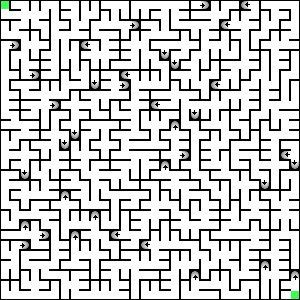

# Labyrinth Generator
v1.0

## Description
This little script generates random labyrinths containing tunnel connections to make solving a little more interesting.

## Customization
The 'LabTiles' folder contains all the necessary tile images. You can change them to your liking and even change the size but make sure that the aspect ratio remains square and that all tiles have the exact same size. Don't change the images' names, as they indicate the orientation and if the tile is a tunnel or not (T = tunnel, N = north, E = east, S = south, W = west (in that order)).
The 'config.json' allows for additional tweaking:
- WIDTH and HEIGHT: The number of tiles (not the number of pixels) for the labyrinth
- START and DEST: Coordinates for the start end destination point of the labyrinth
- CON_PROB: All tiles of the labyrinth are processed one after another. This value is the probability that a tile is connected to a neighbouring tile, that was not yet processed. I recommend a value between 0.6 and 1.
- MIN_TUN_DIS and MAX_TUN_DIS: Tunnel length is a random value between these two.
- LOOSE_ENDS: Hard to explain. A value greater than 0 is necessary! Keep it at 5 or try understanding my _well organized_ code, haha.
